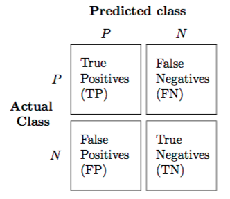

--- 
title: "Big Data: Primeiros Passos em R"
subtitle: "\u2694 <br/> Módulo I: Introdução à conceitos de paralelismo"  
author: "Ministrante: PGMAT-UFBA - Mateus Maia <br/> <br/> LED Date: Um encontro sobre Estatística e Data Science <br/> <br/>"
date: '`r Sys.Date()`'
output:
  xaringan::moon_reader:
    # lib_dir: libs
    css: ["example.css","maia-fonts.css"]
    nature:
      highlightStyle: github
      highlightLines: true
      countIncrementalSlides: false
---
```{r setup, include=FALSE,message=FALSE}
options(htmltools.dir.version = FALSE,warn = FALSE,warning=FALSE)
options("getSymbols.warning4.0"=FALSE)
library(tidyverse)
library(sparklyr)
library(doParallel)
library(foreach)
library(kernlab)

```
#Processamento em paralelo

<br/>

.center[.big[O processamento em paralelo pode ser definido como sendo a utilização de mais de um processador de maneira simultânea para a realização de determinada tarefa.]]

```{r fig.align='center',out.height=300, out.width=300,echo=FALSE}
knitr::include_graphics(path = "hourglass.jpg")
```

---
#Cores
<br/>
```{r fig.align='center',out.height=240, out.width=400,echo=FALSE}
knitr::include_graphics(path = "all_cores-01.png")
```
---
#Paralelismo Funcional

- Cada processo realiza uma função "diferente" ou executa um código diferente em seções que são independentes

- Exemplos:
 - Trabalhos em grupos "mal feitos"
 - Ensemble de algoritmos diferentes

.center[]

---
#Paralelismo de Dados

- Cada proceso realiza o mesmo trabalho em conjuntos de dados únicos e independentes

- Exemplos:
 - 10 pintores pintando um muro
 - Bagging

.center[]

---
#CPU
<br/>
<br/>
<br/>
```{r warning=FALSE,message=FALSE,fig.align='center',echo=FALSE}
knitr::include_graphics(path = "false_cpu-01.png")
```
---
#A verdadeira CPU
.pull-left[
```{r fig.height=0.1,fig.width=0.1,warning=FALSE,message=FALSE,echo=FALSE,fig.align='center'}
knitr::include_graphics(path = "false_cpu-01.png")
```
<br/>
<br/>
<br/>

```{r fig.height=0.1,fig.width=0.1,warning=FALSE,message=FALSE,echo=FALSE,fig.align='center'}
knitr::include_graphics(path = "true_cpu.png")
```
]
.pull-right[
- Muitos erram ao confundir a CPU com o que na verdade é o gabinete do equipamento

- **CPU**(Central Processing Unit): Também conhecido como processador é responsável por calcular e realizar tarefas realizadas pelo usuário. É considerado o "cérebro" do PC.
]
---
#CPU e Core

.center[]

.center[.small[Ctrl+Alt+Del]]
---
#Sequencial *vs* Paralelo

```{r fig.align='center',out.height=400, out.width=360,echo=FALSE}
knitr::include_graphics(path = "sequencial-parallel-01.png")
```
---
class: inverse, center, middle

# Um rápido ()

---
# *"The Joy of Functional Progamming"*

.center[]

.center[bit.do/fffDx]
---
class: inverse, center, middle

# DoParallel: Abordagem de procesamento paralelo no R
---
#Pacotes *doParallel* & *foreach*

- O pacote *foreach* dá uma construção diferente para construção de laços em R, com o suporte em paralelo.

- Em outras palavras, através do pacote, é possível tornar o código mais rápido, com poucas alterações ao dividir as iterações entre os cores

```{r warning=FALSE,message=FALSE}
#Importando as bibliotecas
library(doParallel)
library(foreach)
#Passos inicias
n_cl<-detectCores()-1 #Por quê "-1" 
cl<-makeCluster(7) #A função makeCluster permite a criação da estrutura para o número de clusters.
cl
registerDoParallel(cl) #Através do register os cores são programados para serem utilizados no %dopar% 
```
---
#Toy Example

.pull-left[
```{r}
#Consideremos a estrutura de laço,
#calcularemos a raiz dos números
#de 1:4
foreach(i=1:4) %do%{
  sqrt(i)
}
```
]
.pull-right[
```{r}
#Para fazer a mesma estrutura em
#paralelo basta utilizar %dopar%
foreach(i=1:4) %dopar%{
  sqrt(i)
}
```
]

---
#Combine

- O argumento ".combine" permite combinar os resultados de cada umas das repetições que ocorrerão em paralelo em cada cluster
```{r}
#Aqui o argumento 'c' representa o 'concatenar'
foreach(n=c(10,100,1000),.combine = 'c') %dopar%{
  rnorm(3,mean = n)
}
#"cbind" e "rbind" também podem ser utilizados
foreach(n=c(10,100,1000),.combine = 'cbind') %dopar%{
  rnorm(3,mean = n)
}
#Operadores aritiméticos também são uma opção
foreach(n=c(10,100,1000),.combine = '+') %dopar%{
  rnorm(3,mean = n)
}
```

---
#Aplicação: Holdout Repetido

.center[]

---
#Example: Parallel Validation

- Considerando um a utilização de um *holdout* repetido *n* vezes, cada uma dessas repetições são independentes e podem ser parallelizadas.

Construindo uma função para uma repetição temos:

```{r warning=FALSE,message=FALSE}
library(kernlab)
ksvm_holdout<-function(formula,data,split_ratio=0.7){
  #Splitting
  class_name<-as.character(formula[[2]]) #Selecionando a variável resposta
  training_index<-sample(x = 1:nrow(data),
                         size = round(split_ratio*nrow(data)))
  training<-data[training_index,] #Conjunto treinamento
  test<-data[-training_index,]    #Conjunto teste
  #Training
  mod<-ksvm(formula,data=training) #Gerando modelo
  pred<-predict(mod,newdata=test)  #Armazenando predição
  #Construindo matriz de confusão
  cf<-table(pred,test[,class_name])
  acc<-sum(diag(cf))/sum(cf)
  return(acc)
}
```

---
#Example: Parallel Validation

```{r}
#Carregando a base de dados spam através
#da library(kernlab)
data(spam)

#Rodando o svm com 20 repetições em paralelo
system.time(
spam_rep100<-foreach(i=1:20,.combine = "c",.packages = "kernlab") %dopar%{
  ksvm_holdout(formula = type~.,data = spam,split_ratio = 0.7)
})
spam_rep100[1:5]

#Rodando o svm com 20 repetições sequencialmente
system.time(
spam_rep100_seq<-foreach(i=1:20,.combine = "c",.packages = "kernlab") %do%{
  ksvm_holdout(formula = type~.,data = spam,split_ratio = 0.7)
})

```

---
#Example: Parallel Validation

- Utilizando o *foreach* e o *dorpar*, gere um boxplot dos valores do **Recall** considerando o modelo de **árvore de decisão** e o **holdout** com 100 repetições. .small[(Utilize o pacote: *rpart*)]

- .small[**Dica**: utilizando o rpart, para o predict retornar a variável resposta utilize:
        predict(modelo,newdata=dados,type='class')]

.pull-left[
<br/>
<br/>
$$Recall=\frac{TP}{TP+FN}$$
]
.pull-right[

]
---
#Example: Parallel Validation

.pull-left[
```{r,warning=FALSE,message=FALSE}
library(rpart)
tree_holdout<-function(formula,data,split_ratio=0.7){
  #Splitting
  class_name<-as.character(formula[[2]])#Selecionando a variável resposta
  training_index<-sample(x = 1:nrow(data),
                         size = round(split_ratio*nrow(data)))
  training<-data[training_index,]#Conjunto treinamento
  test<-data[-training_index,]   #Conjunto teste
  #Training
  mod<-rpart(formula,
             data=training)#Gerando modelo
  pred<-predict(mod,newdata=test,
                type='class')#Armazenando predição
  #Construindo matriz de confusão
  cf<-table(test[,class_name],pred)
  recall<-cf[1,1]/sum(cf[1,])
  return(recall)
}
```
]
.pull-right[
```{r warning=FALSE, message=FALSE,out.height=300,out.width=300}
#Calculando os modelos em paralelo
#através da função tree_holdout
recall_tree_spam_rep100<-foreach(i=1:10,
                                 .combine = "c",
                                 .packages = "rpart") %dopar%{
  tree_holdout(formula = type~.,
               data = spam,split_ratio = 0.7)
}
#Gerando boxplot
boxplot(recall_tree_spam_rep100,
        main="Tree Recall Rep=100")
```
]
---
#Example: Random Forest

```{r warning=FALSE,message=FALSE}
#Carregando pacote
library(randomForest)
#Carregando a base
data(spam)

#Rodando randomForests com 250 árvores 
#em paralelo, e combinando-as
system.time(
random_forest_100<-foreach(ntrees=rep(250,8),
                           .combine = randomForest::combine,.packages = 'randomForest') %dopar%{
  randomForest(type~.,data=spam,ntree=ntrees)
})
random_forest_100
```
---
#Example: Random Forest

```{r}
#Fazendo o mesmo porém,
#sequencialmente
system.time(
random_forest_100_seq<-foreach(ntrees=rep(250,8),.combine = randomForest::combine,.packages = 'randomForest') %do%{
  randomForest(type~.,data=spam,ntree=ntrees)
})
random_forest_100_seq

```
---
class: inverse, center, middle

# Quando utilizar do %dopar%

---
# Quando utilizar do %dopar%

- Para valer a pena o a utilização do %dopar% é necessário que a função em questão seja computacionalmente intensiva, caso contrário não é vantajoso a utilização do %dopar%

<br/>
<br/>
.center[
```{r}
stopCluster(cl)
```
]

---
class: title-slide-final, middle
background-image: url(logo.png)
background-size: 150px
background-position: 9% 15%

# Perguntas?
# Obrigado pela atenção

.pull-down[

<a href="mailto:mateusmaia11@gmail.com">
.white[`r icon::fa("paper-plane")`mateusmaia11@gmail.com]
</a>
      
<a href="https://twitter.com/MateusMaiaM">
.white[`r icon::fa("twitter")` @MateusMaiaM]
</a>

<a href="https://github.com/MateusMaiaDS">
.white[`r icon::fa("github")` @MateusMaiaDS]
</a>

<a href="http://www.led.ufba.br/">
.white[`r icon::fa("exclamation")` LED - Laboratório de Estatística e Datascience]
</a>

<a href="http://ime.ufba.br/">
.white[`r icon::fa("graduation-cap")` Instituto de Matemática e Estatística - UFBA]
</a>

<br><br><br>

]
